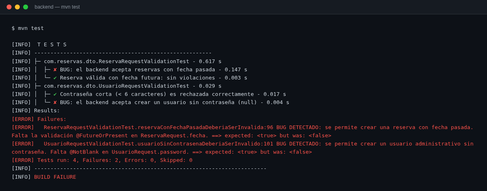
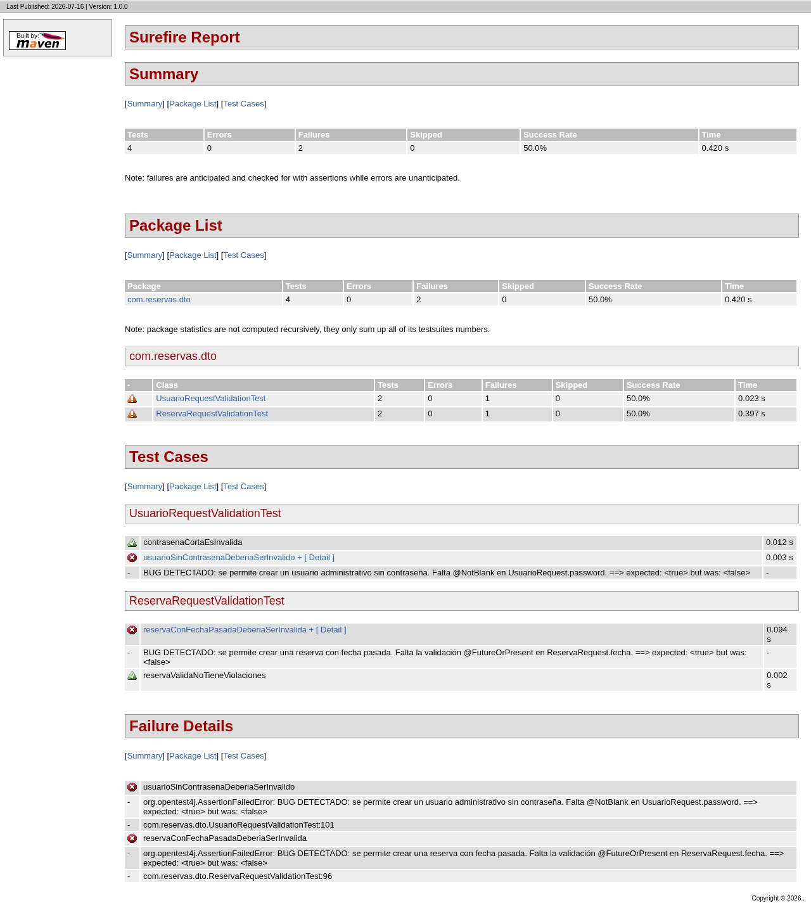
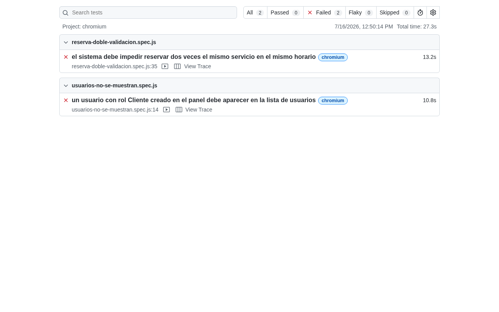
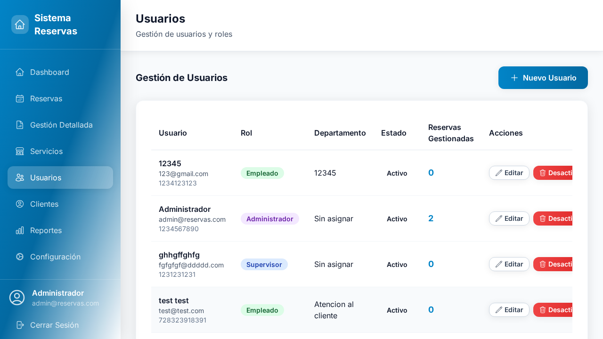
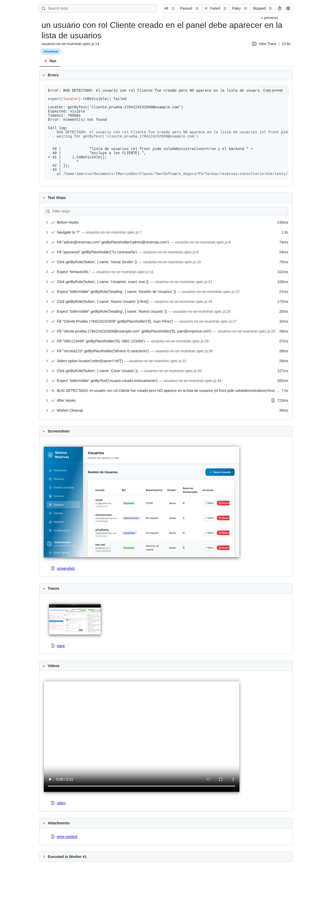
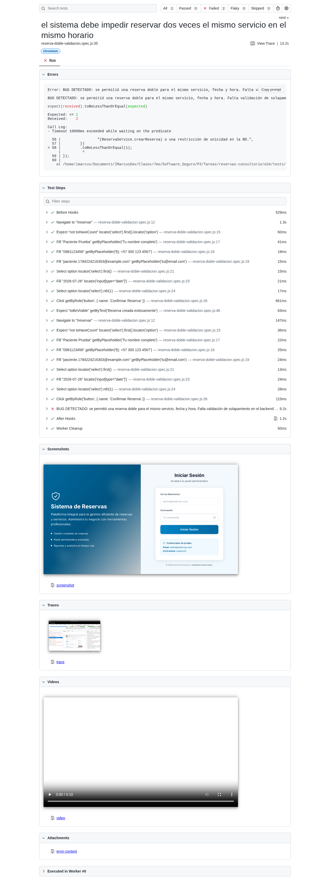

# Evidencias — Taller de Pruebas

**Sistema de Reservas** · 4 pruebas: 2 unitarias (JUnit) + 2 E2E (Playwright).
**Las 4 detectan bugs reales**: cada falla es la evidencia del bug.

## Resumen

| #   | Prueba                             | Tipo     | Bug detectado                                    | Resultado |
| --- | ---------------------------------- | -------- | ------------------------------------------------ | --------- |
| 1   | `ReservaRequestValidationTest`     | Unitaria | Se aceptan reservas con **fecha pasada**         | ✘ falla   |
| 2   | `UsuarioRequestValidationTest`     | Unitaria | Se crea usuario admin **sin contraseña**         | ✘ falla   |
| 3   | `usuarios-no-se-muestran.spec.js`  | E2E      | Los usuarios con rol **Cliente no se muestran**  | ✘ falla   |
| 4   | `reserva-doble-validacion.spec.js` | E2E      | Se permite **reserva doble** en el mismo horario | ✘ falla   |

## Ejecución

```bash
cd backend && mvn test
cd e2e && npm install && npm test
```

---

## 1 · Pruebas unitarias (JUnit + Bean Validation)

`backend/src/test/java/com/reservas/dto/`

### Salida de consola — `mvn test`

4 pruebas: 2 de control ✔ y 2 que detectan bugs ✘.



### Reporte HTML — `mvn surefire-report:report`



---

## 2 · Pruebas E2E (Playwright)

### Reporte — `npm run report`



### Bug 1 — el usuario con rol Cliente no aparece en la lista

Se crea "Cliente Prueba" (el backend confirma "Usuario creado exitosamente"), pero
la lista solo muestra roles **Empleado / Administrador / Supervisor**:



Detalle de la prueba, con los pasos y el mensaje del bug:



**Causa:** `Dashboard.js:274` pide `soloAdministrativos: true` y
`UsuarioRepository.findUsuariosAdministrativos()` excluye el rol `CLIENTE`.

### Bug 2 — se permite reservar dos veces el mismo horario

Se reserva dos veces el mismo servicio, fecha y hora. El backend guarda **2**
reservas (`Expected: <= 1` / `Received: 2`):



**Causa:** `ReservaService.crearReserva()` no valida solapamiento y la BD no
tiene restricción de unicidad.

---

## Bugs encontrados y corrección propuesta

| Bug                    | Dónde                           | Corrección                               |
| ---------------------- | ------------------------------- | ---------------------------------------- |
| Fecha pasada aceptada  | `ReservaRequest.fecha`          | Agregar `@FutureOrPresent`               |
| Usuario sin contraseña | `UsuarioRequest.password`       | Agregar `@NotBlank`                      |
| Clientes no visibles   | `Dashboard.js:274`              | Quitar el filtro `soloAdministrativos`   |
| Reserva doble          | `ReservaService.crearReserva()` | Validar horario ocupado + unicidad en BD |
